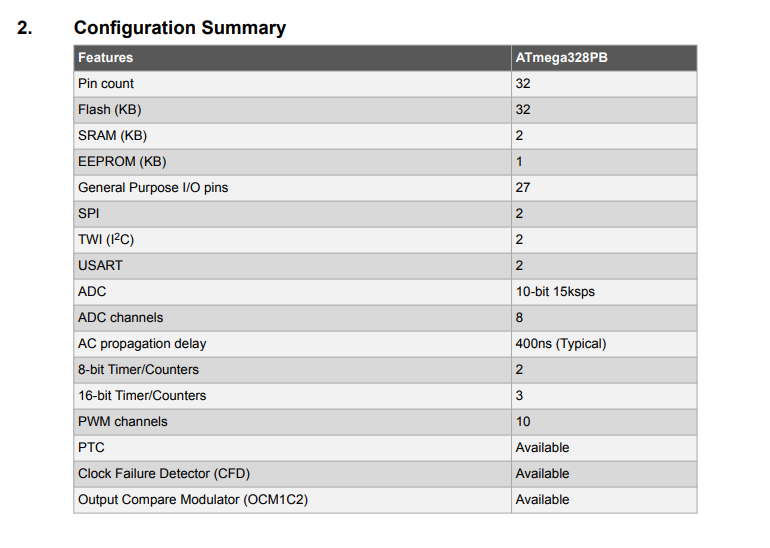
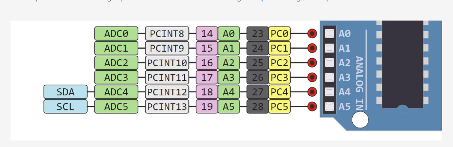
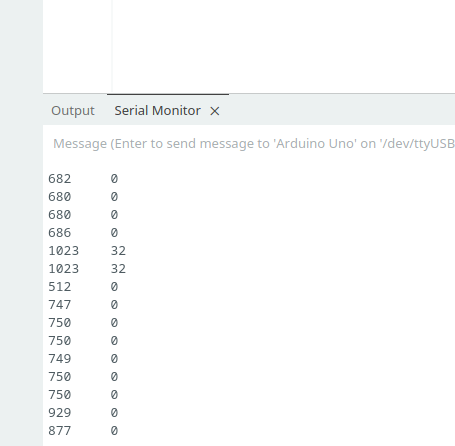
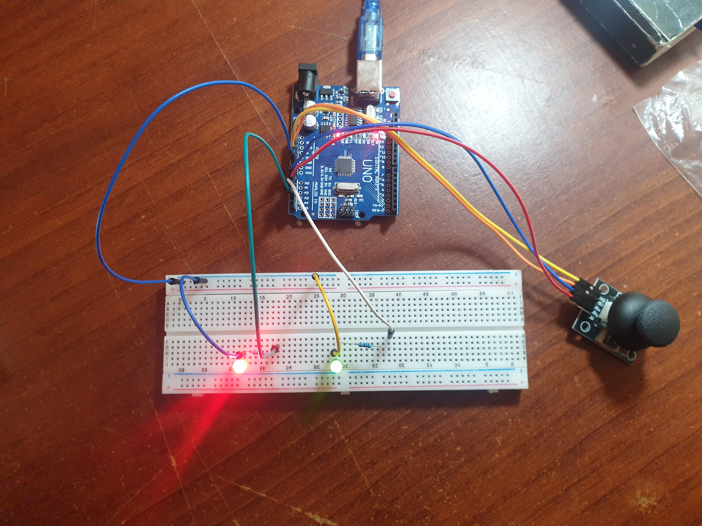

###	Joystick usage

```
I'm using arduino uno that has Atmega328p as the mcu has ADC resolution of 10 bits
that means the value of each analog channel can very from 0 to (2^10 - 1 = 1023)
```


#### Analog pin out


```
connect VRx to A0 and VRy to A1
```

#### *why Serial.begin(9600)*
```
serial begin establish serial communication between my board and my computer
and that number 9600 called buad rate in other words the rate that
at which your two devices will communicating over serial
```

##### *check if hook everything right*




